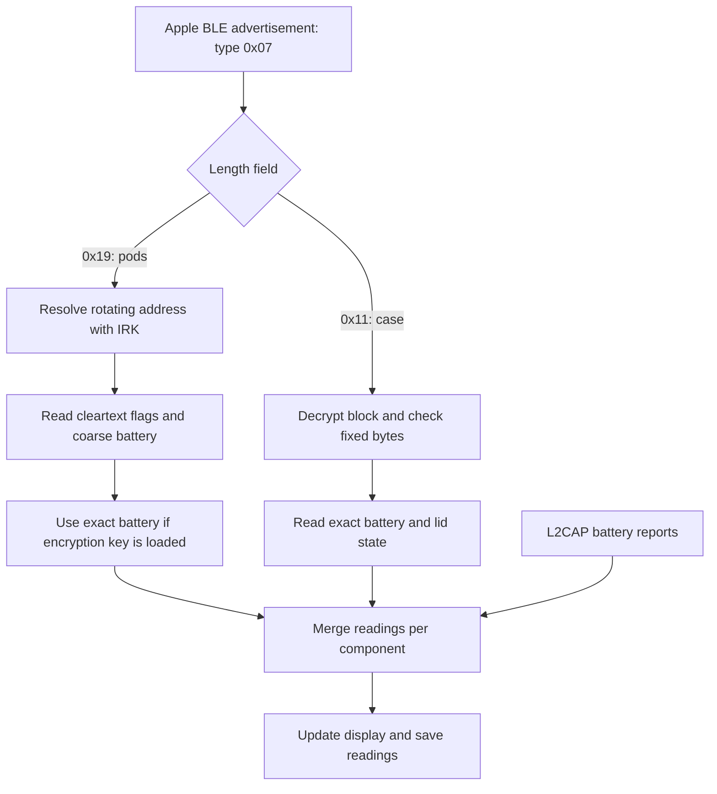

# AirPods BLE: battery, identity and lid state

AirPods expose battery data through a connected control link and two independent BLE advertisers: the pods and the case. **The case broadcasts even with the lid shut**, so fresh battery readings do not require a connection.

Companion documents: [L2CAP control link](l2cap.md) and [BLE research evidence](ble-research.md). Behavior is checked against the current code; hardware observations come from the September 2026 captures. Unknown fields remain unassigned.

## Where readings come from

| Source | Connection needed? | Battery precision | Other information |
| --- | --- | --- | --- |
| L2CAP control link | Yes, pairing alone is insufficient | 1% | Noise control, ear detection |
| Pods' BLE advertisement | No | 10% cleartext; 1% decrypted | In-case/in-ear flags; lid state when the advertising pod is in the case |
| Case's BLE advertisement | No, works with lid shut | 1% decrypted | Lid state and open counter |

The buds do not answer connection attempts inside a shut case. That does not stop the case's own BLE broadcasts.



The tray applies these rules separately to the left pod, right pod and case:

| Incoming reading | Result |
| --- | --- |
| Control link reports a component | Store it with source `Link`; BLE cannot replace it while the link is open |
| Control link marks it disconnected | Keep its previous value and status, but release its `Link` priority |
| BLE reports a known level | Replace the component unless protected by the open control link |
| BLE reports absent | Preserve the previous reading; do not blank the display |

Within a pod advert, known decrypted levels replace cleartext levels; absent decrypted fields leave the cleartext value intact. Pod and case broadcasts have equal priority: the latest accepted value wins. Lid transitions are tracked across both advertisers, independently of their addresses, and logged.

## Identify the format before decoding

Both formats use Apple manufacturer ID `0x004c` and type `0x07`. Offsets below start at the type byte, excluding the manufacturer ID. The length field counts bytes **after the type and length**, so the complete data is two bytes longer.

```text
Pods:  07 19 | 9 cleartext bytes | 16 encrypted bytes   = 27 bytes
Case:  07 11 | 06                | 16 encrypted bytes   = 19 bytes
       type length
```

The original notes call these the 25-byte and 17-byte formats, using the length field. Dispatch by format first: case ciphertext interpreted as pod fields can produce plausible but false battery levels. The tray checks the case's size and length field first, then requires 27 bytes for the pod path; the pod parser does not independently validate its length field.

### Pods: cleartext fields

| Offset | Meaning |
| --- | --- |
| 0–1 | Type `07`, length `19` |
| 2 | Mode: reject `00` pairing mode, which uses another layout |
| 3–4 | Model ID, big endian; the parser requires suffix `20` |
| 5 | Status: bit 5 primary-left; bit 6 this pod in case; bit 4 one pod in case; bit 2 both in case; bits 1/3 in-ear flags |
| 6 | Pod batteries: low nibble primary, high nibble secondary |
| 7 | Low nibble case battery; bits 4/5 primary/secondary charging; bit 6 case charging |
| 8 | Lid: bit 3 set = shut; bits 0–2 count opens. Only trust lid state when this pod is in the case |
| 9–10 | Colour, connection state |
| 11–26 | Encrypted block |

A battery nibble from `0` to `10` means 0–100% in 10% steps. Any value above `10` is unknown; `15` is the documented absent marker. Map primary/secondary to left/right using bit 5. In-ear mapping also depends on whether the advertising pod is in the case; see [the parser](../src/aap/proximity.hpp).

### Decrypted blocks: different offsets

Both blocks use AES-128 ECB with the stored encryption key. Their battery encoding is shared; their layouts are different. These offsets start at the **decrypted block**, not the advertisement.

| Offset | Pods' block | Case's block |
| --- | --- | --- |
| 0 | Flags; `0x04` tracked lid-open-or-pod-out | Observed header `29` |
| 1 | Primary pod battery | Observed header `20` |
| 2 | Secondary pod battery | Lid: bit 3 set = shut; bits 0–2 open counter |
| 3 | Case battery | Case battery |
| 4–5 | Observed constants `4c 96` | Left battery, right battery |
| 6–7 | `ff`, then address fragment begins | Fixed `51 0b` |
| 8 | Address fragment | Fixed `00` |
| 9 | Address fragment | Transient value; meaning unknown |
| 10–11 | Observed state values; meanings not fully assigned | Fixed `00 00` |
| 12–15 | Varies each advertisement; purpose unknown | Little-endian counter, approximately one tick per second |

In the pods' block, bytes 7–9 contain the low three bytes of the buds' public address while both pods are in the case, otherwise zero. Bytes 1–2 swap as the advertising pod changes. A pod away from the case can report the other pod and case as absent after losing contact.

The case always uses left/right order. Pulling only the right pod changed byte 5 to `ff`, confirming that mapping. Its counter likely measures uptime: it advanced by 68,400 over 19 hours. **Never include counter bytes in the fixed-byte check.** Byte 14 looked constant on the first day, then changed and caused valid adverts to be rejected.

### Battery byte encoding

Check the entire byte for `ff` first: it means absent, with no charging state. Otherwise, bit 7 is charging and bits 0–6 are the percentage.

```text
3d =  61%                 bd = 61%, charging
5e =  94%                 de = 94%, charging
ff = absent               (not "127%, charging")
```

Example case block, lid shut and both pods charging:

```text
29 20 | 08  | 3d   | de   | dd    | 51 0b 00 | 00 | 00 00 | f7 82 16 00
header  lid   case   left   right   fixed      ?    fixed   counter
              61%    94%+   93%+
```

Putting the case on a charger changed `3d` to `bd`. Opening it and removing both pods changed the lid to `09` and both pod bytes to `ff`. These controlled changes establish the field meanings.

## Keys and device identity

| Key | Purpose | Limitation |
| --- | --- | --- |
| IRK (identity resolving key) | Identifies the pods through rotating private addresses | Does not resolve the case address |
| Encryption key | Decrypts both BLE formats | Case identification relies on the decrypted layout matching known fixed bytes |

The pods' address rotated on every lid open during testing. A model match alone cannot identify your pair: another pair was broadcasting during the investigation. The tray rejects other pod addresses only when an IRK is loaded; without one, it accepts matching pod layouts from any pair. The `--ble` diagnostic requires an IRK match as well as an encryption key before displaying the pods' `EXACT` summary.

The case uses a random static address, which was observed changing even with the lid shut. Decrypt it with the stored key and check fixed bytes instead of relying on its address or the IRK's `[MINE]` marker. The current [case parser](../src/aap/case_advert.hpp) rejects mismatches at bytes 6–8, 10 and 11. Unexpected header, flag or battery levels above 100 produce warnings. This is a layout check, not an authenticated message format.

To obtain keys, connect the buds and run `airpods --keys`. After the control handshake, the request is `04 00 04 00 30 00 05 00`; reply opcode `31` contains a count and length-prefixed keys. Key type `01` is the IRK; `04` is the encryption key.

The fetcher writes `$XDG_CONFIG_HOME/airpods/proximity-keys` (default `~/.config/airpods/proximity-keys`), then requests owner read/write permissions. It prints key types, lengths and the first two bytes of each key, not the full keys. Keep the file private: an IRK allows tracking across address rotations. Keys load when scanning starts; restart the app after fetching them.

## Freshness and troubleshooting

The [scanner](../src/bt/ble_scanner.hpp) starts BlueZ discovery with `Transport=le` and `DuplicateData=true`, then forwards Apple `ManufacturerData` from D-Bus device events. It waits for a powered adapter and requests discovery again when BlueZ reports discovery stopped.

The case was observed advertising about once per second over legacy `ADV_IND`, LE 1M, with the lid open or shut. Delivery was sparser even with that configuration: one 30-second capture yielded six HCI reports and three distinct payloads in the app. These are measured rates, not a guaranteed update interval.

The [battery store](../src/core/battery_store.hpp) saves known levels and charging states with one timestamp in `$XDG_STATE_HOME/airpods/last-battery` (default `~/.local/state/airpods/last-battery`). At startup, the tray shows the loaded cache's age as “Last seen”. That age does not advance during the session and is cleared by a battery callback or accepted BLE merge, even if some components retain older values. There is no per-component freshness timer.

| Symptom | What to check |
| --- | --- |
| No closed-case reading | Look for `07 11`, not only the pods' `07 19` format; confirm an encryption key is available |
| Case never marked `[MINE]` | Expected: the IRK identifies pod addresses, not the case |
| Impossible battery value | Check format dispatch and reject cleartext nibbles above 10 |
| Absent component shown charging | Check `ff` before splitting charging and level bits |
| Valid case adverts suddenly rejected | Ensure the fixed-byte check excludes bytes 12–15 |
| Old reading remains visible | Absent fields preserve readings; a missing age label does not prove every component is fresh |

Use `airpods --ble --debug` to inspect format selection and decoding locally. Raw and decrypted adverts contain device identifiers. The tray's debug logs also show merges and anomalies. Core implementations: [pod decryption](../src/aap/encrypted_payload.hpp), [BLE routing](../src/core/tray_app.hpp), [battery merging](../src/aap/battery.hpp).

An nRF52840 sniffer was used to identify and confirm the case format. It was not proven necessary: the packets were already reaching the BT500 and appearing as unparsed payloads. See [capture evidence and sniffer notes](ble-research.md).
