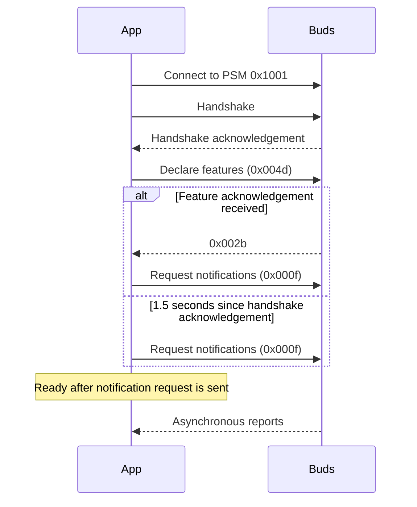

# L2CAP: the AirPods control link

The app uses Apple Accessory Protocol (AAP) over Bluetooth Classic L2CAP for battery reports, noise control, proximity keys and optional head tracking. BLE broadcasts use a separate path; see [BLE](ble.md) for advertisements and battery merge rules.

This guide describes the current implementation, not a complete Apple protocol specification. Packet constants are in [packets.hpp](../src/aap/packets.hpp); connection sequencing is in [session.hpp](../src/aap/session.hpp).

## Connection and framing

| Setting | Implementation |
| --- | --- |
| Transport | Bluetooth Classic (`BDADDR_BREDR`), not BLE GATT |
| Socket | `AF_BLUETOOTH`, `SOCK_SEQPACKET`, `BTPROTO_L2CAP` |
| PSM (service endpoint) | `0x1001` |
| Peer | Explicit `--address`, otherwise a connected device selected from BlueZ |
| Receive buffer | 1,024 bytes per session poll |

Automatic selection prefers a connected device whose name contains `AirPods`, then a connected Apple device with an audio icon. Pairing alone is insufficient. An explicit address bypasses selection, but does not make sleeping buds reachable. Buds inside a shut case do not answer connection attempts; the case can still provide [BLE readings](ble.md).

The repository's operational notes report that only one client can hold the control link. Another client such as LibrePods can leave this app connected but receiving no reports.

The [socket layer](../src/bt/l2cap_socket.hpp) preserves packet boundaries; the app does no stream reassembly. After the special handshake, packets generally begin:

```text
04 00 04 00 | opcode, 2 bytes little endian | command-specific body
```

There is no universal body length field. The session dispatches by prefix and leaves body validation to individual parsers. Unknown packets are logged in debug mode but otherwise ignored. Packets larger than the receive buffer have no explicit truncation check.

## Opening the session



| Message | Bytes sent or matched |
| --- | --- |
| Handshake | `00 00 04 00 01 00 02 00 00 00 00 00 00 00 00 00` |
| Handshake acknowledgement prefix | `01 00 04 00` |
| Feature declaration | `04 00 04 00 4d 00 d7 00 00 00 00 00 00 00` |
| Feature acknowledgement prefix | `04 00 04 00 2b 00` |
| Notification request | `04 00 04 00 0f 00 ff ff ff ff ff` |

Some firmware omits the feature acknowledgement, so the session sends the notification request after 1.5 seconds from the handshake acknowledgement. This timer advances only when `Poll()` runs. There is no corresponding handshake-acknowledgement timeout in `Session`.

`IsOpen()` means the socket exists. `IsReady()` means the notification request was sent successfully; it does not confirm that any report arrived. Command methods do not enforce readiness; callers that need it must poll for it.

`--keys` does. It polls until `IsReady()` before sending its request, for up to four seconds, then requests anyway with a warning. It previously sent the request straight after `Connect()`, which raced the handshake the buds ignore everything before: directly attached hardware acknowledged in time, but an adapter forwarded over USB/IP into WSL did not, and the request was dropped with no reply.

## Reports and commands

| Opcode | Use | Current handling |
| --- | --- | --- |
| `0x0004` | Battery report | Tray and console consume it |
| `0x0006` | Ear detection | Prefix defined, but not dispatched |
| `0x0009`, subcommand `0x0d` | Noise control | Tray sends changes and reads reported mode |
| `0x0017` | Head tracking | Console gesture mode starts and parses the stream |
| `0x0030` / `0x0031` | Proximity key request / reply | `--keys` saves keys for BLE |

### Battery

Reports are pushed by the buds, not fetched on a timer. Console `--interval` controls printing only.

```text
04 00 04 00 04 00 | count | component 01 level status 01 | ...
                   1 byte          5 bytes per entry
```

The [battery parser](../src/aap/battery.hpp) accepts at most three entries, requires a total size of `7 + 5 × count`, and checks both `01` markers in each entry.

| Field | Values |
| --- | --- |
| Component | `01` headset (AirPods Max), `02` right, `04` left, `08` case |
| Level | Percentage byte, 1% resolution |
| Status | `00` unknown, `01` charging, `02` discharging, `04` disconnected |

A disconnected entry preserves the last level and status but releases the control link's priority, allowing BLE to update that component. See [merge behavior](ble.md#where-readings-come-from).

### Noise control

```text
04 00 04 00 09 00 0d | mode | 00 00 00
```

Modes: `01` off, `02` noise cancellation, `03` transparency, `04` adaptive. The reported mode uses the same prefix and mode offset. Matching includes subcommand `0d` because opcode `09` also carries other settings. A successful send alone does not confirm the selected mode; the tray updates from reports.

### Proximity keys

Request: `04 00 04 00 30 00 05 00`.

```text
04 00 04 00 31 00 | count | type ?? length ?? | key bytes | ...
```

The [reply parser](../src/aap/proximity_keys.hpp) reads the count at offset 6, then four-byte entry headers starting at offset 7. Type is entry byte 0; length is entry byte 2. Types `01` and `04` are the IRK and encryption key. The other two header bytes are not interpreted.

`airpods --keys` waits up to five seconds for a reply, polling every 200 ms, then closes the session. See [key storage and identity](ble.md#keys-and-device-identity). Avoid `--keys --debug`: session debug logging prints entire received packets, including key replies. Normal key fetching prints only types, lengths and two-byte prefixes.

### Head tracking

`airpods --console --gestures` starts tracking when the session becomes ready and sends a stop command on exit. The default command variant is `alt`; `--tracking macos` selects the other captured start/stop pair. Their bodies are replayed bytes whose full encoding is not understood.

Start/stop packets carry a little-endian body length at offsets 10–11, with the body starting at offset 12. Compile-time assertions check the length: the repository records that an overrun can leave the buds unresponsive until reset in the case.

The [sample parser](../src/aap/head_tracking.hpp) requires at least 55 bytes, the tracking prefix, kind `44` or `45` at byte 10, and zero at byte 11. It reads signed little-endian 16-bit orientation values at offsets 43/45/47 and horizontal/vertical acceleration at 51/53. These feed the console's nod/shake detector; the tray does not use them.

## Polling, disconnects and diagnosis

The tray watches the socket through Qt and also polls every 500 ms to advance session timers. Read errors, closure and failed connection attempts tear down the session and schedule another attempt after five seconds. A session that opens but does not complete the handshake within ten seconds is also torn down, but retried after sixty: the buds ignoring a second AAP session is not something a reconnect clears, and retrying it at five seconds would seize and release the single-holder link continuously. BLE scanning continues independently.

Ten minutes without a battery report from either source prompts a check of both. The scanner reconciles its discovery session, and the control link reopens only if BlueZ still lists the buds as connected, so buds that are simply away are left alone. The window's “Last seen” line carries whatever the check finds.

The console exits on link loss rather than reconnecting. `--once` exits after printing a known battery reading; it has no overall timeout if reports never arrive.

| Symptom | Check |
| --- | --- |
| No device selected | Buds must be connected in BlueZ; explicit `--address` bypasses name selection |
| Connection timeout with lid shut | Use BLE for case readings |
| Socket open, no reports | Check competing clients, handshake acknowledgement and notification request |
| No feature acknowledgement | The 1.5-second fallback needs ongoing session polling |
| No ear-detection events | The current dispatcher does not handle them |
| Gesture mode stays silent | Check tracking reports and firmware command variant |

`airpods --console --debug` shows transmitted and received AAP packets. Inspect logs locally before sharing; debug logging does not redact packet contents.
